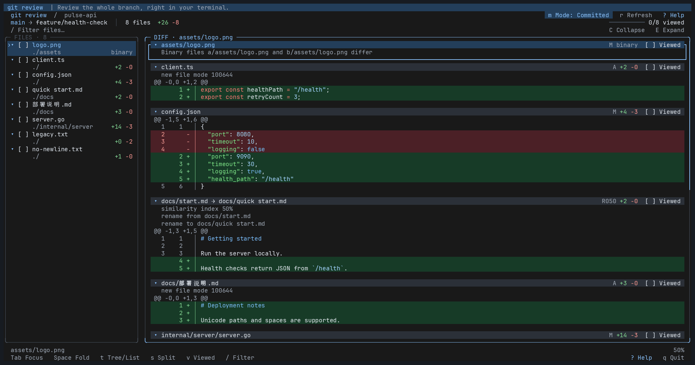

# git review

**Review your branch. Keep your place.**

A pull-request-style review experience, right in your terminal. Browse the whole branch, read highlighted diffs, and check off files as you go.

[](docs/demo.gif)

[View the full-size demo](docs/demo.gif) · [Download the recording](docs/demo.cast)

*Spot word-level changes in inline and split diffs, browse a file tree, resume viewed progress, and switch between committed and local changes.*

## Make your next review easier

- **See the whole change.** Get branch-wide and per-file additions and deletions, then jump straight to the code that matters.
- **Spot the exact edit.** Deeper red and green backgrounds highlight changed words within modified lines, in both inline and split views. Identifiers (including `snake_case` and `camelCase`) and numbers are highlighted as whole words. Syntax colors stay visible in light and dark themes.
- **Make progress you can see.** Mark a file viewed to fold it and move on. Come back later and pick up the same review where you left off.
- **Find your way through large diffs.** Switch between a file list and a directory tree, find files with fuzzy search, search diff text, and collapse files you've already read.
- **Review before you commit.** `git review -w` includes staged edits, unstaged edits, and new files Git hasn't tracked yet.
- **Keep actionable notes.** Comment on individual lines or ranges, then export your review as Markdown with paths, line numbers, and code excerpts.
- **Work the way you like.** Use the keyboard or mouse, with syntax highlighting and automatic light and dark themes.

Local review needs only Git. GitHub PR review also requires an installed, logged-in [GitHub CLI (`gh`)](https://cli.github.com).

## Get started

### Homebrew

```sh
brew install cross-entropy-ai/tap/git-review
```

Upgrade with `brew update && brew upgrade git-review`. The formula installs the binary for your macOS or Linux machine, on amd64 or arm64.

Before the first release is added to the tap, use `brew install --HEAD cross-entropy-ai/tap/git-review` to build from source. Homebrew installs Go for this initial source build.

### Install directly

Install the latest release on macOS or Linux with one command:

```sh
curl -fsSL https://github.com/cross-entropy-ai/git-review/releases/latest/download/install.sh | sh
```

The installer detects your platform, verifies the download's SHA-256 checksum, and installs to `~/.local/bin`. Run the same command to upgrade. Git is required; no Go toolchain or package manager is needed.

Add `export PATH="$HOME/.local/bin:$PATH"` to your shell configuration if needed, then run `git review` inside any Git repository. Set `INSTALL_DIR` to choose another location: `curl -fsSL https://github.com/cross-entropy-ai/git-review/releases/latest/download/install.sh | INSTALL_DIR=/your/bin sh`.

### Download manually

Prefer to install it yourself? These links always download the latest release:

| Platform | Download |
| --- | --- |
| macOS · Apple Silicon | [darwin_arm64](https://github.com/cross-entropy-ai/git-review/releases/latest/download/git-review_darwin_arm64.tar.gz) |
| macOS · Intel | [darwin_amd64](https://github.com/cross-entropy-ai/git-review/releases/latest/download/git-review_darwin_amd64.tar.gz) |
| Linux · x86-64 | [linux_amd64](https://github.com/cross-entropy-ai/git-review/releases/latest/download/git-review_linux_amd64.tar.gz) |
| Linux · ARM64 | [linux_arm64](https://github.com/cross-entropy-ai/git-review/releases/latest/download/git-review_linux_arm64.tar.gz) |

Download [checksums.txt](https://github.com/cross-entropy-ai/git-review/releases/latest/download/checksums.txt) to verify your archive. Extract it and put `git-review` on your `PATH`, for example on Apple Silicon:

```sh
tar -xzf git-review_darwin_arm64.tar.gz
mkdir -p ~/.local/bin
install -m 755 git-review ~/.local/bin/git-review
```

Downloads and the installer become available after the first release. You can build from source in the meantime.

### Build from source

Prefer to build it yourself? Install [Go](https://go.dev/) (version in [go.mod](go.mod)) and [just](https://github.com/casey/just):

```sh
git clone https://github.com/cross-entropy-ai/git-review.git
cd git-review
just install
```

This installs to `~/.local/bin`. Run `just demo` from the checkout for a ready-made sample review. Open `config.json` to see word-level highlights for numbers, strings, and multiple edits on one line; press `s` to compare layouts.

## Choose what to review

**Automatic by default** — review local changes when present; otherwise review committed changes since the common ancestor with your base:

```sh
git review                   # Same as git review --auto
```

Force a scope when needed:

```sh
git review -w                # --working-tree: staged, unstaged, and untracked changes
git review -c                # --committed: committed changes, even with local edits
```

Committed review compares `merge-base(base, head)` to `head`. Both refs can be branches, tags, or commit IDs. Passing refs selects committed review; add `--auto` to use them only as the fallback when there are no local changes. The three mode flags are mutually exclusive. Auto only selects the initial scope at startup. The highlighted Mode control shows Working tree or Committed. Click it or press `m` to open a fuzzy-search popup listing Working tree and local branches. Type to filter, use ↑/↓ to select, Enter to open, or Esc to cancel. Each row shows added/deleted line totals; branch totals use the configured base (or the default base) and the same merge-base comparison as the review. Selecting a branch changes the review without checking it out; refresh keeps the selected scope. Startup base/head options are preserved.

A few useful variations:

```sh
git review --base develop     # Review committed changes against a different base
git review v1.0 HEAD          # Compare a tag and a commit ref
git review v1.1.0...v1.2.0    # Shorthand for git review v1.1.0 v1.2.0
git review -C /path/to/repo    # Review another repository
git review --theme light      # Choose light or dark manually
git review --stat             # Print a quick change summary
```

The `base...head` shorthand requires both refs and cannot be combined with another positional ref, `--base`, or `--head`. It uses the same merge-base comparison as the two-ref form.

## Review a GitHub pull request

Install [GitHub CLI](https://cli.github.com) and log in before using remote review:

```sh
gh auth login

git review https://github.com/owner/repo/pull/918
git review '#918'                         # PR in the repository identified by origin
git review 918                            # Local ref first; otherwise origin PR #918
git review https://github.com/owner/repo 918
```

Quote `'#918'` so the shell passes it as an argument. A full PR URL works outside a Git checkout. Number-only targets use `git remote get-url origin`, including HTTPS and SSH origins. If origin points to a fork, its PR numbers are used; a full PR URL can select the upstream repository instead. Explicit `--base 918` always treats `918` as a local ref. A local comparison error never silently changes the target to a PR.

GitHub review calls `gh api` to read PR metadata, paginated file diffs, and Viewed states. It never clones, fetches, or checks out a repository. Missing `gh` or an inactive login produces installation/login instructions. Private repositories require access through the active `gh` account. For GitHub Enterprise, log in to the URL's host with `gh auth login --hostname HOST`.

The header shows **GitHub PR** and the repository/PR number. Inline/split views, the file tree, file and text search, and folding work as in local review. The PR scope stays fixed; clicking Mode or pressing `m` explains why switching is unavailable.

- Press `v` or click Viewed to update the file's state on GitHub. `[~]` means the update is still saving; a failure restores the previous state and opens an error dialog for confirmation.
- Press `r` to reload both the diff and GitHub's Viewed states. `[!]` means GitHub reports new changes since the file was viewed.
- `--no-state` keeps progress in memory and disables GitHub Viewed reads and writes. `--stat` also performs no Viewed synchronization.
- While Viewed updates are pending, `r` and `q` ask you to wait and try again after saving. `Ctrl+C` can exit immediately; a request already received by GitHub may still complete.

GitHub supplies fixed patch context, so PR targets do not support custom `--context`, local scope flags, or `--base`/`--head`. PRs exceeding the files API's 3000-file limit are rejected. Binary files, metadata-only changes, and omitted/incomplete patches have an explicit notice; unavailable text is never shown as a complete diff.

## A few keys go a long way

| Key | What it does |
| --- | --- |
| `↑` / `↓` or `j` / `k` | Scroll and navigate files |
| `n` / `p` | Jump to the next / previous file, or text match when search is active |
| `Space` | Fold or unfold the selected file |
| `z` | Toggle all files collapsed / expanded |
| `t` | Toggle Tree/List |
| `s` | Toggle inline / split diff (old on the left, new on the right) |
| `e` | Open the selected local file in the default editor |
| `v` | Mark viewed, fold, and move on |
| `f` | Open the fuzzy file finder popup |
| `/` | Search text across the current comparison's diff |
| `c` | Select a code line for a comment; press `c` again to write |
| `C` | Browse, edit, delete, or jump to saved comments |
| `x` | Export comments as Markdown and open in the default editor |
| `Tab` | Switch between the sidebar and diff |
| `m` | Search and select Working tree / local branch |
| `r` | Refresh the review |
| `?` / `q` | Floating help / quit |

Prefer the mouse? Click a file to jump to it, click its checkbox to mark it viewed, and scroll either pane. In the tree, click a directory to expand or collapse it.

Press `f` for an embedded fzf-style file finder; no external `fzf` installation is needed. Type parts of a filename or path to narrow the list, including rename source paths. Use arrows, Tab/Shift+Tab, or Ctrl+N/P to select, Enter to open, and Esc to cancel. Choosing a file keeps the full review list intact.

Press `/` to search added, removed, and context lines in all loaded diff hunks. Search is literal and case-insensitive, with live highlights and a match counter. Matches in folded files expand automatically; inline and split views are supported. Press Enter to confirm, then `n` / `p` to navigate matches with wraparound. Esc clears the search and restores `n` / `p` file navigation. While typing a query, `n` and `p` remain ordinary text. This searches the displayed comparison, not unchanged repository content outside its hunks. Press `?` for a scrollable help popup; Esc or `q` closes it and returns to the same review position.

Press `e` to edit the selected file in your local working tree, including when reviewing committed changes. The editor follows Git's settings: `GIT_EDITOR`, `core.editor`, `VISUAL`, then `EDITOR`, with Git's fallback (usually `vi`). Editor arguments such as `code --wait` are supported. After closing the editor, press `r` to refresh. Files missing locally and remote PR comparisons without a local working tree cannot be opened.

Errors such as an unavailable editor, a failed refresh, or a failed Viewed update appear in a confirmation popup. Press Enter, click **Enter OK**, or press Esc to acknowledge and return to your review. Long details can be scrolled; concurrent errors are shown one at a time so none are overwritten by status updates.

## Comment on code and export a review

Press `c` to place a cursor on a source line in the selected file. Move with `j` / `k` or the arrow keys, then press `c` or Enter to open the comment editor. Ordinary code clicks only focus the file. After entering comment mode with `c`, click a code line to select it. Lines with saved comments have a `●` marker; the selected line uses `▸`.

For a multiline comment, use **Shift+↑/↓** to start or extend a selection automatically. Ordinary arrows, `j` / `k`, or clicking a code line return to single-line selection. A range stays within the same file, diff hunk, and old/new side so it never includes undisplayed code. In split view, clicking the left or right cell selects that side; Tab switches sides for a single line when both exist. Deleted lines are anchored to the old file; added lines use the new file. Context lines can use either side. Binary files and unavailable patches cannot receive line comments.

Write in the popup, using Enter for a newline and **Ctrl+S** to save locally, or directly to GitHub when reviewing a PR. The PR button is labeled **Ctrl+S GitHub**. Chinese text, bracketed paste, arrows, Home/End, Backspace/Delete, and Ctrl+U (clear input) are supported. Esc cancels the draft. Saving an empty comment is rejected, and a failed save keeps the draft open for retry. Selecting an already commented local range opens its existing note for editing. In PR review, `c` starts a new comment; use `C` to open existing discussions.

Press `C` to browse comments for the current file, including existing GitHub line comments and replies in PR review. Press `Tab` in the list to switch between the current file and all files; the title shows the scope and comment count. Comments are grouped under file-path dividers and ordered by line number, with replies kept directly after their parent comment in creation order. Use `j` / `k` to select, Enter to edit, `g` to jump to the line, and `d` followed by Enter to delete (Esc cancels deletion). Press `r` in the list to toggle **Resolve / Unresolve**; resolved comments remain available to read, edit, and export. Press `x` from the review or this list to export all comments as Markdown, regardless of the list filter. In the export popup, press Enter with the destination blank to create a uniquely named Markdown file in the OS temporary directory and open it in your default editor (using the same Git editor settings as `e`). You can also enter an existing directory to create a uniquely named report there, or a filename to choose the exact output path. Relative paths use the local repository root, or the current directory for a remote PR. Existing files are never overwritten. Exported files remain after the editor closes, and the status shows their location; if the editor fails to open, the error popup includes the saved file path. The report groups notes by file and includes old/new line ranges, source excerpts, comparison revisions, authors and GitHub comment URLs when available, and Markdown comment text. Unsynced edits are labeled separately.

Local review comments belong to an exact comparison and live beside viewed progress in `.git/git-review/*.comments.json`. They are restored when you reopen that comparison and kept separate from Viewed state. A changed comparison starts a separate set of local notes; resolved/unresolved status is saved with each note and included in Markdown exports. Export before refreshing a changed working tree if you need its current notes. With `--no-state`, notes stay in memory for the session, GitHub comment reads and writes are disabled, and Markdown export remains available.

In PR review, existing line comments load from GitHub, showing their authors and replies. `Ctrl+S` creates or updates the comment on GitHub immediately; this publishes an individual comment, not a pending batch review. From `C`, use `a` to reply to the selected discussion, Enter to edit, `r` to resolve/unresolve the entire discussion (including its replies), or `d` and Enter to delete from GitHub. GitHub enforces access permissions; editing is limited to the comment author. Missing permissions, rejected line ranges, changed PR revisions, account changes, and network errors open an error popup. A failed save keeps the editor and a local draft, while a failed deletion or resolve operation keeps the comment and its previous status. Drafts and cached comments live under `git-review/comments/` in the OS user configuration directory, separated by PR and account. PR drafts survive new commits and restarts. Unchanged anchors remain retryable; changed anchors are marked outdated and remain readable and exportable. Explicitly reselecting the same range with `c` reattaches an outdated, unsent draft to the current code.

Press `r` from the review to reload GitHub comments and Viewed state. Outdated comments remain readable, replyable, and exportable, but are not attached to unrelated current lines. Refresh preserves unsynced edits. While a comment operation is in flight, its editor stays open and duplicate saves are ignored. Requests are not automatically retried. Submissions with an uncertain result are matched against newly published comments from the same account and discussion; confirmed submissions are restored as server comments. If the result cannot be confirmed, the draft is labeled **Sync uncertain** and another create request is blocked. Inspect GitHub before discarding the draft and posting again. Definite rejections, such as permission errors, keep a retryable draft. Replies continue to work when a discussion’s original comment has been deleted but replies remain.

## Good to know

- Auto mode checks staged, unstaged, and untracked changes, respecting Git ignore rules. `-w` / `--working-tree` shows current on-disk changes against `HEAD`; a clean worktree stays in this mode with an empty diff. `-c` / `--committed` always shows committed changes. Refreshing with `r` keeps the current scope, even if local changes appear or disappear.
- Reviewing leaves your files and staging area unchanged; `e` lets you edit files explicitly. Local review progress is saved under `.git/git-review/`; use `--no-state` for a session without saved progress.
- Local progress belongs to an exact comparison. Refreshing changed content starts a fresh review for the whole comparison; unchanged content keeps its viewed marks.
- Use a terminal at least 90 columns wide for the sidebar. `--no-mouse` restores native terminal text selection; `--no-color` disables colors.

For the full option list, run `git review --help`. To work on the project, run `just` for available tasks or `just check` to verify a change.

Maintainers: see [Publishing a release](docs/releasing.md) for release automation.
